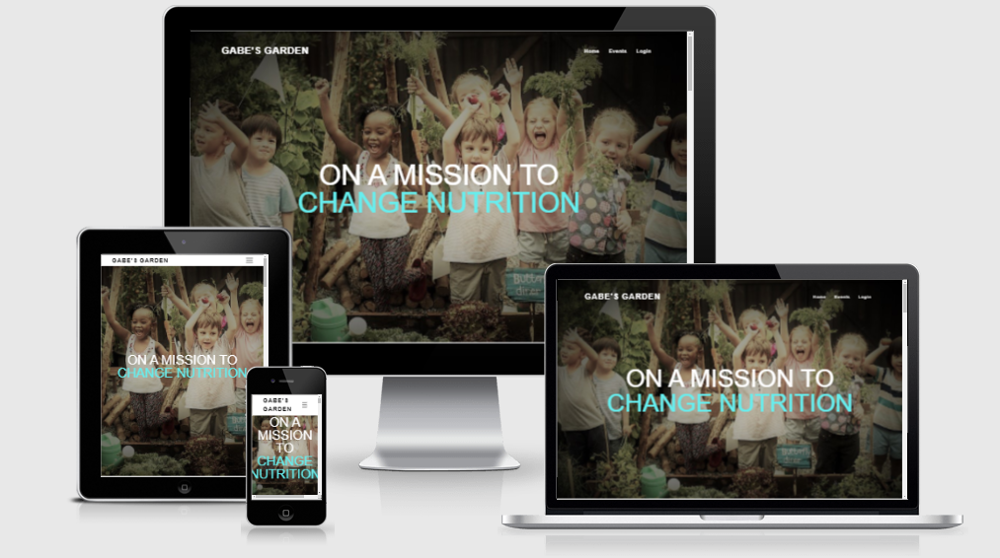

# Gabe’s Garden #
Welcome to Gabe's garden. Fed up with America's food choices in the cafeteria's across schools nationwide, 12-year-old Gabe has set out on a mission to change the way kids eat. Gabe's idea is to have a garden that is grown, cultivated, and maintained  by the students. The harvest will then be used for delicious and nutritious recipes in the our school's cafeterias created and hopefully cooked, by the students. The goal is to inspire as many schools as possible to begin their own garden's providing **real** nutrition to our children again and not being served the normalized frankenfood which is surely contributing to the childhood chronic illness epidemic across the United States.
*[](https://.github.io/ /) 

* 

---

## Contents ##

- [UX (User Experience)](#ux-user-experience)
  - [Project Goals](#project-goals)
  - [User Goals](#user-goals)
  - [User Stories](#user-stories)
  - [Site Owner Goals](#site-owner-goals)
  - [User Requirements and Expectations](#user-requirements-and-expectations)
  - [Design Choices](#design-choices)
    - [Fonts](#fonts)
    - [Colours](#colours)
    - [Wireframes](#wireframes)
- [Technologies](#technologies)
  - [Languages](#languages)
  - [Libraries](#libraries)
  - [Tools](#tools)
- [Features](#features)
  - [Features Implemented](#features-implemented)
  - [Future Features](#future-features)
  - [Considered Features](#considered-features)
- [Testing](#testing)
- [Deployment](#deployment)
  - [Running Money Pot Locally](#running-money-pot-locally)
- [Credits](#credits)
  - [Audio](#audio)
  - [Images](#images)
  - [Colour](#colour)
  - [Image editing](#image-editing)
  - [Code Ideas](#code-ideas)
- [Acknowledgements](#acknowledgements)

---

## UX (User Experience) ##


### Project Goals ###

The **goal** 

### User Goals ###

- **Learn about the mission of Gabe's Garden** 
- **Signup on the website**
- **See what events are being offered at the garden** 
- **Sign up to volunteer their time at the garden** 
- **Contact** 

### User Stories ###
* As a user, I want to easily understand what the website is about.
* As a user, I want to easily be able to navigate the site.
* As a user, I want to see how the fruits and vegetables are being used in recipes.
* As a user, I want to be able to register as a member.
* As a user, I want a "Forgot Password" option in case I forget my password.
* As a user, I want to be able to subscribe to a newsletter.
* As a user, I want to be able to signup to volunteer.
* As a user, I want to be able to easily access the links to social media.
* As a user, I want to be able to contact the organization with questions or concerns.
* As a user, I want to be able to delete an event that I signed up for if something changes.

<a></a>

### Site Owner Goals ###
* As a site owner, I want to create an interactive environment for all demographics.
* As a site owner, i want to make sure people are inspired to start their own garden.
* As a site owner, I want people to be able to learn easy tips and tricks.
* As a site owner, I would like for the site visitor;s to be able to connect with social media links.
* As a site owner, I would like to inspire more schools to take action and join in on the farm to table lifestyle.

### User Requirements and Expectations ###
* The site must stand out. 
* The mission of the Garden must be easily received.
* The content needs to be relevant to all audiences.
* The visual elements should be visually appealing.
* The signup sheet must work properly
* The contact form should work properly.
* When a vegetable is clicked, it should take you to the kid-friendly recipe in the recipes section.
* The recipes section should provide 
* The event calendar should work with signup events. 


[Back to Top](#table-of-contents)

<a></a>

### Design Choices ###


#### Fonts ####
Big Shoulder Stencil display is the font chosen for the Title and headings. This font was chosen because it is bold, stands out, and the title looks amazing. I feel the characteristics of this font will really help bring the website to life. 

Monda was chosen the paragraphs and information throughout the site. This style was chosen as it seems that the two fonts will compliment each other nicely. They wont be too different yet both are bold and stand out. i want the font to grasp the user's attention from the moment they hit the landing page and Monda paired with Big Shoulder Stencil Family is the perfect match.

<a></a>

#### Colours ####

An array of colors were used throughout the site. In the spirit of simplicity though, the predominant colors on the site are white and black.

Since the images are what the users should focus on most, white and black seemed to be the best approach.

Laid sporatically  through the site however, you will find hints of greenish-blues such as: #009999.
This color went beautifully on the site. It nicely breaks up the black and white without being visually straining to eyes.


[Back to Top](#table-of-contents)


---
<a></a>


## **Wireframes**

#### Original Wireframes


View original wireframes here:

[embed]http://example.com/file.pdf[/embed]
---

#### Existing Wireframes


View Existing Wireframes here:

[embed]http://example.com/file.pdf[/embed]

<a></a>

## Features ##

<a></a>

## Existing Features

1. Navbar
    - The navigation bar will display Gabe's Garden logo on the top left corner.
    - The navbar will display page links on the right side.
    - The navbar will break down into a hamburger to become mobile responsive.
    - The navbar will display the links to the pages which are:

        - Home
        - Events
        - LogIn
        - SignUp
        
 2. Contact Form
    - The  contact form acts as both a contact form and footer.

          - Contact Form
          - Social media links
          - Copyright information

<a></a>


For the landing page, I went with a simple hero image with bold writing overlaying the top.

#### Landing Page 

- Hero Image

    - Gabe's Garden index page will feature an image of a group of kids excited and happy to be growing their own vegetables.

    * 

    <a></a>

## Footer and Contact Form

 The footer is essentially a contact form. The footer also displays links to social media and copyright information.

* 

## Events
 The event page will feature an image but the main point of the page will be the cards that display the events seen here.

- The site includes an event page.
   - Events will include: 
   - classes, parties, festivals, and much more.


* 

---


  Events will be displayed on cards with two buttons. One to register and one to remove the event.

## Log In Page

- The login page will be a form with two inputs:

  - Name
  - Password

## Sign Up Page
-  
## Profile

- Users will have a very simple profile where they can add or delete the events they have signed up for.

## Features Implemented ###

The features to be implemented will be a reminder notification to the user's email to remind them of their upcoming event.

Another feature to be implemented will  be a donation link capable of accepting donations.


- **Social media links**

The site has social media links displayed at the footer of the page, as well as a button to take them to the contact/feedback form.


- **Functional contact form**

<a></a>

### Future Features ###


### Considered Features ###

- **Users do not have an option to choose levels or tasks of the game**

[Back to Top](#table-of-contents)

---

<a></a>

### **Database Structure**

MongoDB was used to set the database for this project

#### **Users:**

Key      | Value
---------|-----------
_id      | ObjectId
username | String
password | String

#### **Events:**

Key              | Value
-----------------|-----------
_id              | ObjectId
catergory_name   | String
event_name       | String
event_description| String
event_date       | String
event_time       | String


<a></a>

## Technologies ##

### Languages ###

- [HTML](https://developer.mozilla.org/en-US/docs/Web/HTML)
- [CSS](https://developer.mozilla.org/en-US/docs/Web/CSS)
- [JavaScript](https://developer.mozilla.org/en-US/docs/Web/JavaScript)

### Libraries ###

- [jQuery](https://jquery.com/)
- [Popper](https://popper.js.org/)
- [Popper JS](https://popper.js.org/)
- [Bootstrap](https://getbootstrap.com/)
- [Font-Awesome](https://fontawesome.com/icons?d=gallery)
- [Google fonts](https://fonts.google.com/)
  
### Tools ###

- [Git](https://git-scm.com/)
- [GitHub](https://github.com/)
- [Visual Studio Code](https://code.visualstudio.com/)

[Back to content](#contents)

---

<a></a>

## **TESTING**

### UI

1. Navigation
    - 
2. Footer
    - 

3. 
    -

### Functionality 

1. Add An Event
    - The user should be able to add a desired event.
    - This can be completed by a create button on the form link.
    - The button sends the event data to the profile.
    - The event is then stored on the person's profile.

2. Register for an event
    - The user must register in order to add an event.
    - The registraion works.
    - Werkzeug password security is implemented properly.
    - The user will garner an error message if incorrect pattern are entered.

3. Login/log out
    - The login function works as expected.
    - The user must provide their proper username and password.
    - Error message will flash if it the information is incorrect.
    - The user is then prompted to their profile.

4. Delete
    - User will have the ability to delete their event 

### Responsive Design

1. Mobile
    - All pages tested on Android and current iOS platforms and returns as expected.
    - Poor response on Galaxy Fold (See unresolved issues.)
    - 

2. Tablet
    - All pages display properly across tablet screens. 

3. Desktop
    - Tested with Safari & Chrome
    - All items load as expected
    - Navbar working and displaying correctly
    - No overflow issues experienced
    - All items in correct positioning. 

### Issues and resolutions
---
* Problem: The mobile-first side nav links are not dislplaying. The error is "toggle is not defined"
* Cause: 
* Resolution: 
---
---
* Problem: In the last hours of coding, Gitpod decided to make it even more eventful by not allowing Changes to the live-website 
  The CSS changes being made were not being displayed.

* Cause:  This was an IDE issue.

* Resolution: This issue was not entirely solved. Throughout the last hours, I have had to completely stop my workspace. Shut it entirely down and 
  and the restart by stopping  and resetting the workspace to render the changes made. 
---
---
* Problem: Profile returned 404 error event. "Undefined error: 'event' is undefined.

* Cause: In  the middle of correcting cards fto be styled, I improperly deleted an important value tag needed to render the page.

* Resolution: In order to solve this minor issue, I was returned the value tag to it's home and the profile page rendered properly again.
---
---
* Problem: Improperly detecting and existing user re-registering.

* Cause: Duplicate username being used. 

* Resolution: Detect duplicate username and redirect to the login page.
---
### Unresolved Issues
---
* Poor breakdown response on Galaxy Fold.
* 
* 
---

## **Deployment**

### Local Deployment

I have created The-Garden project using Github, from there I used [Gitpod](https://gitpod.io/) to write my code. 
Then I used commits to git followed by "git push" to my GitHub repository. 
I've deployed this project to Heroku and used "git push heroku master" to make sure my pushes to GitHub were also made to Heroku. 

This project can be ran locally by following the following steps: (
I used Gitpod for development, so the following steps will be specific to Gitpod. 
You will need to adjust them depending on your IDE. You can find more information about installing packages using pip and virtual environments [here](https://packaging.python.org/guides/installing-using-pip-and-virtual-environments/)


To clone the project: 

1. From the application's repository, click the "code" button and download the zip of the repository.
    Alternatively, you can clone the repository using the following line in your terminal:
  
    ```
    git clone https://github.com/susanmarie87/The-Garden.git
    ```
1. Access the folder in your terminal window and install the application's [required modules](https://github.com/Susanmarie87/The-Garden/blob/master/requirements.txt) using the following command:

    ```
    pip3 install -r requirements.txt
    ```

    1. Sign-in or sign-up to [MongoDB](https://www.mongodb.com/) and create a new cluster
    * Within the Sandbox, click the collections button and after click Create Database (Add My Own Data) gs-Garden
    * Set up the following collections: [Click here to see the exact Database Structure](#database-structure)
      

          *** Add in Mongo data structures here ***

1. In your IDE, create a file containing your environmental variables called env.py at the root level of the application. 
    It will need to contain the following lines and variables:
    ```
    import os

    os.environ["IP"] = "0.0.0.0"
    os.environ["PORT"] = "5000"
    os.environ["SECRET_KEY"] = "YOUR_SECRET_KEY"
    os.environ["DEBUG"] = "True"
    os.environ["MONGO_URI"] = "YOUR_MONGODB_URI"
    os.environ["MONGO_DBNAME"]= "DATABASE_NAME" 
    ```

    Please note that you will need to update the **SECRET_KEY** with your own secret key, as well as the **MONGO_URI** and **MONGO_DBNAME** variables with those provided by MongoDB.
    Tip for your SECRET_KEY, you can use a [Password Generator](https://passwordsgenerator.net/) in order to have a secure secret key. 
    I personlly recommend a length of 24 characters and exclude Symbols.
    To find your MONGO_URI, go to your clusters and click on connect. Choose connect your application and copy the link provided. 
    Don't forget to update the necessary fields like password and database name. 

    If you plan on pushing this application to a public repository, ensure that env.py is added to your .gitignore file.

1. The application can now be run locally. In your terminal, type the following command 
    ```
    python3 app.py. 
    ```
    ### To deploy your project on Heroku, use the following steps: 

1. Login to your Heroku account and create a new app. Choose your region. 
1. Ensure the Procfile and requirements.txt files exist are present and up-to-date in your local repository.  
    Requirements:
    ```
    pip3 freeze --local > requirements.txt
    ```
    Procfile:
    ```
    echo web: python app.py > Procfile
    ```
1. The Procfile should contain the following line:
    ```
    web: python app.py
    ```

1. Scroll down to "deployment method"-section. Choose "Github" for automatic deployment.
1. From the inputs below, make sure your github user is selected, and then enter the name for your repo. Click "search". When it finds the repo, click the "connect" button.
1. Scroll back up and click "settings". Scroll down and click "Reveal config vars". Set up the same variables as in your env.py (IP, PORT, SECRET_KEY, MONGO_URI and MONGODB_NAME):
    !You shouldn't set the DEBUG variable in under config vars, only in your env.py to prevent DEBUG being active on live website. 

    ```
    IP = 0.0.0.0
    PORT = 5000
    SECRET_KEY = YOUR_SECRET_KEY
    MONGO_URI = YOUR_MONGODB_URI
    MONGO_DBNAME = DATABASE_NAME
    ```

1. Scroll back up and click "Deploy". Scroll down and click "Enable automatic deployment".
1. Just beneath, click "Deploy branch". Heroku will now start building the app. When the build is complete, click "view app" to open it.
1. In order to commit your changes to the branch, use git push to push your changes. 
    

[Back to Top](#table-of-contents)

<a></a>
## Credits ##


### Images ###


[Cooking Class photo by: Gareth Hubbard](https://unsplash.com/photos/qPcSUERqBAc)

[Dance Party photo by: Ben Rosett](https://unsplash.com/photos/nYugmV-SY6s)

[Future Leader Kiana Bosman](https://unsplash.com/photos/0pB01U2NDCQ)

[Hero Image](https://phys.org/news/2018-09-kids-food-gardening.html)

[Water Conservation photo by: Johnathan Kemper](https://unsplash.com/photos/xvVAkT3I-84)

[Little girl with plants by: Jonathan Borba](https://unsplash.com/@jonathanborba)

[Planter-Box](https://www.hercampus.com/school/u-mass-amherst/growing-garden-kitchen-scraps/)

[Smiling boy with book by: Ben White](https://unsplash.com/photos/4K2lIP0zc_k)

[Elaine Casa](https://unsplash.com/photos/qgHGDbbSNm8)

[Water-boy photo by: Filip Urban](https://unsplash.com/photos/ffJ8Qa0VQU0)

[Volunteer by: Anna Earl](https://unsplash.com/photos/J-Jb1niw1j0)

[Yoga Gnome by: Dorota Dylka](https://unsplash.com/photos/Y6nFvt1ebyw)

[Photo by:Aleksandra Sapozhnikova](https://unsplash.com/photos/N3DbwlJZpRU)

[Photo by:Aleksandra Sapozhnikova]("https://unsplash.com/@rruprrup?utm_source=unsplash&utm_medium=referral&utm_content=creditCopyText") 

  
[Photo by:Runze Shi]("https://unsplash.com/@wizard_s?utm_source=unsplash&utm_medium=referral&utm_content=creditCopyText")


Photo by Artem Beliaikin from Pexels (apple trees)

Photo by Artem Beliaikin from Pexels (apple trees)
  

paige-cody-z8gKIE4Kz0Y-unsplash (3) (little boy carrying bucket)

samantha-gades-fIHozNWfcvs-unsplash (1) (outdoor party redhat)
### Colour ###


### Image editing ###


### Code ideas ###

Website template adapted from:

[Website Template](https://www.youtube.com/channel/UCbwXnUipZsLfUckBPsC7Jog)

--
Cards for events adapted from:

[Event Card](https://codepen.io/RajRajeshDn/pen/qBEGeEp(cards))
- 

[Back to content](#contents)

---

## Acknowledgements ##

I would like to recognize the people who have helped me through this project:

- [Simen Daehlin](https://github.com/Eventyret) 

- [Richard Wells](https://github.com/D0nni387)

- [Jonathan Knepher](https://github.com/jknepher)

## The Tutors ## 
   - John
   - Sheryl
   - Michael
   - Scott
   - Alan
 
  They have all spent countless hours helping me solve the most trivial of issues. 
Without their support I could have never made it this far so a major shoutout to them. 

- [Alan McGee](https://codeinstitute.com)

- [Code Institute](https://codeinstitute.com)


[Back to content](#contents)

---
